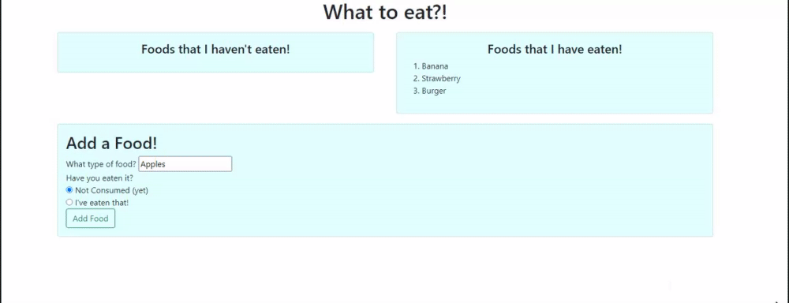

# What to Eat?!


 
## Description

This database was made to help keep track of food bucketlists! Have no idea what to eat for dinner? Take a gander at the "Foods that I have eaten!" list, or if you're feeling daring pick something off the "Foods that I haven't eaten!" list! You can add new foods and there is a checkbox to tell the site what you have eaten and what you haven't. The food entered will then be entered into the website's database and depending on which option is checked will be placed in one of the boxes. If you haven't eaten that particular food type yet you can click the "I ate this!" button and it will be added to the "Foods that I have eaten!" list. Future plans include adding a delete button incase a user misclicks the "I ate this!" button or misspells a food type.

## Snips of code
 
The code snippet below shows how a new food item is created. When the button in the "Add a Food" section is clicked the object that contains the name of the food and whether it has been eaten or not is sent to the code snippet. This code associates the key of the object with the value that the user inputs. An id is then generated and it is all sent to the server.

```
var food = require('../models/food.js');

router.post('/api/food', (req, res) => {
    food.create(['name', 'eaten'], [req.body.name, req.body.eaten], (result) => {
        res.json({ id: result.insertId });
    });
});
```

## Built With

* [HTML](https://developer.mozilla.org/en-US/docs/Web/HTML)
* [CSS](https://developer.mozilla.org/en-US/docs/Web/CSS)
* [JS](https://www.javascript.com/)
* [GitHub](https://github.com/)
* [Git](https://git-scm.com/)
* [node.js](https://nodejs.org/en/)
* [npm](https://www.npmjs.com/)
* [express](https://www.npmjs.com/package/express)
* [express-handlebars](https://www.npmjs.com/package/express-handlebars)
* [mysql](https://www.npmjs.com/package/mysql)
* [MySQL Workbench](https://www.mysql.com/products/workbench/)

## Authors

* Peter Ting

- [Link to Github](https://github.com/Pting1995)
- [Link to LinkedIn](https://www.linkedin.com/in/pting002/)
- [Link to Portfolio](https://pting1995.github.io/Portfolio-mk2/)

## License

This project is licensed under the MIT License 

## Acknowledgments

* Thank you to UC Berkeley's Extension Bootcamp for giving me the opportunity to work on this project!